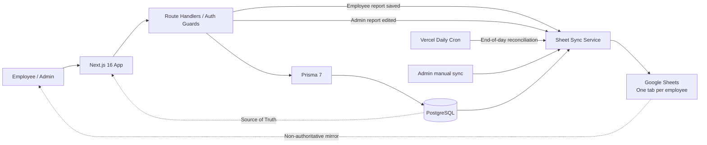

<p align="center">
  
</p>

<h1 align="center">Fardad Report Portal</h1>

<p align="center">
  A production-oriented daily work reporting platform built for Persian-speaking teams, with a Jalali-first experience, role-based administration, PostgreSQL persistence, and controlled Google Sheets synchronization.
</p>

<p align="center">
  
  
  
  
  
  
  
</p>

---

## Overview

Fardad Report Portal replaces a manually maintained spreadsheet-based daily reporting workflow with a structured web application while still preserving Google Sheets as an optional management mirror.

The system is intentionally designed around a single data authority:

> **PostgreSQL + Prisma is the source of truth. Google Sheets is a one-way synchronized projection.**

This keeps authentication, validation, uniqueness, auditability, filtering, and future analytics inside a real relational data model without removing the convenience of a spreadsheet view for operational teams.

---

## Architecture



### Data ownership

```text
PostgreSQL / Prisma
        │
        │ authoritative data
        ▼
   Web Application
        │
        │ automatic event sync + daily cron + manual sync
        ▼
   Google Sheets
```

Direct edits inside Google Sheets are **not imported back into the database**. The next synchronization overwrites managed Sheet ranges with the current database state. This deliberately avoids two-way sync conflicts, reconciliation rules, and split-brain data ownership.

---

## Engineering Highlights

### Jalali-first reporting model

The application treats the Persian calendar as a first-class domain concern rather than a presentation-only conversion layer.

Each report stores:

```text
Gregorian date
Jalali date
Jalali year
Jalali month
Jalali day
```

This allows fast month-based reporting and native Persian calendar navigation without repeatedly deriving the same values at query time.

Missing days are derived dynamically from the current Tehran date, report existence, Fridays, and future dates rather than inserting artificial "missing report" rows into the database.

### Strict report uniqueness

The database guarantees one report per employee per day:

```prisma
@@unique([userId, reportDate])
```

Report submission therefore behaves as an **upsert** instead of creating duplicate daily records.

### Different write rules for employees and administrators

The permission model is intentionally asymmetric:

```text
Employee
  └─ can create/update only today's report

Administrator
  └─ can create/update any employee's report for any date
```

This preserves the original business rule for employees while giving administrators the ability to correct historical data when required.

### Approval-based account lifecycle

New accounts are not immediately trusted.

```text
Registration
    ↓
 PENDING
    ↓
Admin Review
  ↙     ↘
APPROVED  REJECTED
```

The user model also supports `DISABLED`, keeping account state separate from authentication credentials.

### Secure session model

Authentication is implemented with:

- bcrypt password hashing
- signed JWT sessions using `jose`
- `HttpOnly` cookies
- `SameSite=Lax`
- secure cookies in production
- explicit server-side admin guards

Passwords never leave the authentication boundary and are never exported to Google Sheets.

---

## Admin Workspace

The administration panel is designed as an operational control surface rather than a simple CRUD page.

### Report exploration

Administrators can combine:

- employee filtering
- an `All employees` default view
- free-text search
- date-range filtering
- list view
- Jalali calendar view
- month navigation

### Calendar mode

The calendar is generated as a complete Persian month with a Saturday-to-Friday week layout.

Each day cell can represent:

- one employee's report
- multiple employee reports
- missing reports
- future dates

Selecting a day opens a larger management dialog where the administrator can inspect employees and create or edit the selected employee's report for that date.

### List mode

The same dataset can be inspected as a conventional report list, making the UI useful both for chronological auditing and calendar-oriented review.

---

## Google Sheets Integration

Google Sheets is implemented as a **secondary operational mirror**, not as application storage.

The spreadsheet layout intentionally mirrors the company's original human-readable workflow: **each approved employee owns one dedicated tab** named from the employee's full name. The legacy aggregate tabs are removed during synchronization:

```text
کارمندان      ← removed
گزارش‌ها      ← removed
همگام‌سازی    ← removed
```

Each employee tab exposes only two visible columns:

```text
تاریخ | گزارش
```

Additional spreadsheet columns are hidden by the synchronization layer so the Sheet remains focused on daily reporting rather than database-shaped records. Because the target spreadsheet is dedicated to this system, synchronization also prunes tabs that do not correspond to a currently approved employee (including legacy aggregate tabs, default `Sheet1`, and stale former-user tabs).

### Gap-free daily timeline

The database stores actual report records only. The Sheet projection reconstructs the employee's complete daily timeline from the employee's tracking start date through the current Tehran date.

For every calendar day the projection resolves one of these states:

```text
actual report      → stored report text
leave report       → مرخصی
Friday             → تعطیل
past day, no report → گزارشی ثبت نشده است
current day, empty → در انتظار ثبت گزارش
```

This means the spreadsheet cannot contain a date gap such as:

```text
1405/06/21
1405/06/23
```

without `1405/06/22` being generated between them. If the scheduled end-of-day job is delayed, the next report submission, admin edit, or manual sync still reconciles every missing date automatically.

Missing-day rows are a **derived projection**, not fake `Report` records. If an administrator later backfills a historical report, the next sync replaces the red missing row with the real report while PostgreSQL remains authoritative.

### Month sections and visual encoding

The employee timeline is grouped into Jalali-month sections. A merged, emphasized separator row is inserted whenever the month changes:

```text
شهریور 1405
1405/06/31 | ...
مهر 1405
1405/07/01 | ...
```

Every Persian month has a distinct soft fluorescent/pastel row color. The month separator uses a stronger tone from the same palette, while missing-report rows override the month color with a red warning background.

The synchronization layer also:

- applies RTL layout
- freezes the `تاریخ / گزارش` header
- wraps long report text
- sizes the date and report columns explicitly
- hides columns beyond the two public columns
- clears stale values, merges, formatting, and conditional formatting in managed employee tabs
- preserves PostgreSQL as the only authoritative data source

### Automatic synchronization triggers

Synchronization is event-driven as well as scheduled:

```text
Employee report create/update ─┐
                               ├─> sync service ─> Google Sheets
Admin historical report edit ──┤
Daily Vercel Cron ──────────────┤
Admin manual sync ──────────────┘
```

The daily cron runs after the Tehran reporting day has ended. Its primary purpose is to turn unresolved past days into explicit red missing-report rows even if no one submits another report afterward.

Because every sync performs timeline reconciliation, the system is resilient to a missed cron execution: the next successful sync repairs all gaps from the last known date through the current day.

### Sync observability

Each synchronization is persisted through `SheetSyncLog`, including:

```text
status
triggeredById
startedAt
finishedAt
usersCount
reportsCount
message
```

Trigger messages distinguish automatic report events, administrator edits, the daily cron, and manual administrator synchronization. External projection failures therefore remain observable without coupling Google Sheets availability to the core report write path.

Direct edits inside Google Sheets are **never imported back into PostgreSQL**. Managed employee tabs are regenerated from database state, so manual Sheet changes are overwritten on the next synchronization by design.

---

## Persistence Model

The schema is intentionally compact and domain-focused.

```text
User
 ├─ role
 ├─ status
 ├─ approval metadata
 └─ reports[]

Report
 ├─ employee relation
 ├─ Gregorian date
 ├─ Jalali date dimensions
 ├─ report text
 └─ status

Holiday
 ├─ date
 ├─ title
 └─ enabled

SheetSyncLog
 ├─ status
 ├─ counts
 ├─ timestamps
 └─ diagnostic message
```

Notable database constraints and indexes include:

```prisma
User.username                @unique
Report.[userId, reportDate]  @unique
Holiday.date                 @unique
Report.[jalaliYear, jalaliMonth] indexed
Report.reportDate            indexed
User.status                  indexed
User.role                    indexed
```

---

## Deployment Behavior

The deployment pipeline keeps schema initialization explicit:

```text
prisma generate
      ↓
prisma migrate deploy
      ↓
prisma db seed
      ↓
next build
```

This is important for serverless environments where a valid `DATABASE_URL` can exist before the database schema has actually been deployed.

The bootstrap administrator is created from environment configuration during database initialization, while regular users remain approval-driven application records.

---

## Runtime Configuration Notes

The Google Sheets projection uses the existing service-account credentials:

```text
GOOGLE_SHEET_ID
GOOGLE_SERVICE_ACCOUNT_EMAIL
GOOGLE_PRIVATE_KEY
```

`CRON_SECRET` is recommended for protecting the scheduled synchronization endpoint. `SHEET_TRACKING_START_DATE` is optional and can provide a global Gregorian `YYYY-MM-DD` lower bound for generated Sheet history; otherwise an employee timeline begins from the earliest relevant approval/report date.

---

## UI / Design System

The interface is built around a Persian RTL workflow and a restrained glass-layered visual system.

Key UI choices:

- shadcn/ui-style components built on Radix primitives
- Tailwind CSS 4
- Vazirmatn typography
- RTL-first composition
- responsive sidebar shell
- glass surfaces and soft transparency
- Fardad brand green as the primary accent
- Lucide iconography
- desktop-oriented admin density with responsive behavior

The visual layer is deliberately separated from the persistence model, so the product can evolve without coupling spreadsheet structure to UI structure.

---

## Core Technology

| Layer | Technology |
|---|---|
| Framework | Next.js 16 |
| UI runtime | React 19 |
| Language | TypeScript |
| Styling | Tailwind CSS 4 |
| Component primitives | shadcn/ui conventions + Radix UI |
| ORM | Prisma 7 |
| Database | PostgreSQL |
| PostgreSQL adapter | `@prisma/adapter-pg` |
| Authentication | `jose` + bcryptjs |
| Validation | Zod |
| Persian calendar | `jalaali-js` |
| External projection | Google Sheets API |
| Icons | Lucide React |
| Hosting target | Vercel |

---

## Repository Structure

```text
app/
├─ api/
│  ├─ auth/
│  ├─ reports/
│  ├─ admin/
│  └─ cron/daily-report-sync/
├─ admin/
├─ dashboard/
└─ generated/prisma/

components/
├─ ui/
├─ admin-client.tsx
├─ dashboard-client.tsx
├─ app-shell.tsx
└─ auth-shell.tsx

lib/
├─ auth.ts
├─ db.ts
├─ prisma.ts
├─ date.ts
├─ google-sheets.ts
├─ services/
│  └─ google-sheet-auto-sync.ts
└─ types.ts

prisma/
├─ migrations/
├─ schema.prisma
└─ seed.ts

public/
└─ fardad-logo.png
```

---

## Design Decisions That Define the Project

1. **PostgreSQL, not Google Sheets, owns application state.**
2. **Google Sheets sync is intentionally one-way.**
3. **Jalali dates are persisted as queryable dimensions.**
4. **Missing reports are computed instead of materialized, including the Google Sheets projection.**
5. **Employees and administrators have different historical write permissions.**
6. **Account approval is part of the domain model, not an external manual process.**
7. **Database constraints enforce daily-report integrity.**
8. **The deployment pipeline applies migrations before the application is built.**
9. **The UI is designed for Persian RTL use from the start, not retrofitted later.**

---

## Project Status

The current implementation includes the core production workflow:

- authenticated employee and administrator sessions
- registration and admin approval
- daily employee report submission
- monthly report history
- Jalali calendar calculations
- missing-day detection
- administrative list/calendar exploration
- employee and date-range filtering
- historical admin report editing
- PostgreSQL persistence through Prisma
- one-way Google Sheets synchronization
- one Google Sheet tab per approved employee
- gap-free daily Sheet timelines with derived missing-day rows
- Jalali month separators and month-specific pastel formatting
- automatic Sheet sync after employee submissions and admin edits
- end-of-day Vercel Cron reconciliation
- manual administrator sync fallback
- sync logging
- Vercel-oriented database initialization

The codebase is structured to support future analytics, holiday management, notifications, richer audit trails, and additional reporting surfaces without changing the core data ownership model.

---

<p align="center">
  <strong>Fardad Report Portal</strong><br />
  Built as an internal reporting system with a database-first architecture and spreadsheet interoperability.
</p>
